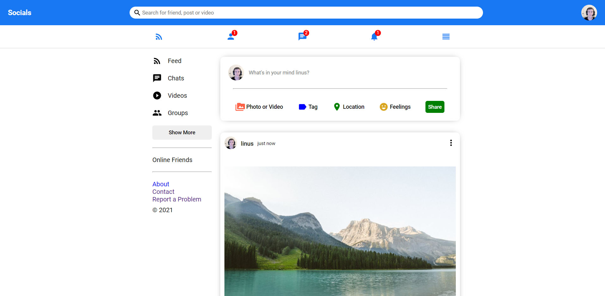

# [Socials](https://socials-2bccb.web.app/)

Socials is a social media website where you can connect with the users and chat with them.

## Demo

https://socials-2bccb.web.app/

test email: linus@gmail.com

password: 123456

## Screenshot



## Tech Stack

**Client:** HTML, CSS, React, Material ui

**Server:** Nodejs, Express

**Database:** MongoDb

## Run Locally

Clone the project

```
git clone https://github.com/SrijanDas/socials-api.git
```

Go to the directory

```
cd socials-api
```

Install dependencies

```bash
npm install
```

Start the server

```bash
npm start
```

Note: You also need to setup the [frontend](https://github.com/SrijanDas/socials-ui)

That's it👍

## Thank you 😃

[](https://srijan-das.web.app/)
[](https://www.linkedin.com/in/srijan-das-3591791b3)
[](https://twitter.com/Srijan_1805)
